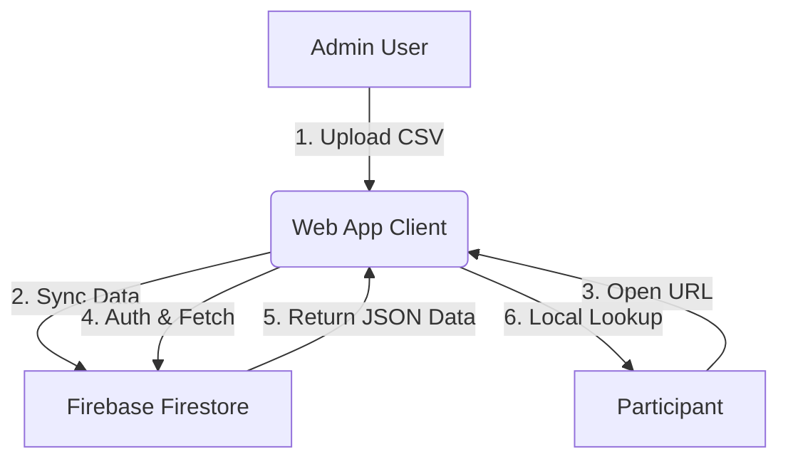

# Project Status & Technical Mechanism: Bus Lookup System

## 1. Project Progress Status

We have successfully built and verified the core application. The system is a **Single Page Application (SPA)** that runs entirely in the browser, powered by **Firebase** for backend data syncing.

### ✅ Completed Features

* **Participant Lookups**: Users can enter their Name and Phone Number to retrieve their assigned Bus and Departure Time.
* **Admin Interface**: A hidden "Admin Mode" allows the client to upload the latest participant data via a CSV file.
* **Cloud Sync**: Data is instantly authenticated and synced to a global Firestore database, meaning all users see updates immediately without refreshing the page code.
* **Security**: basic anonymous authentication prevents unauthorized database scraping while allowing easy public access.
* **Responsive Design**: The UI is mobile-optimized with a premium "slide-in" animation and clear feedback states.

### 🚀 Ready for Deployment

The code is self-contained in `index.html`. It does not require a complex build server. It is ready to be deployed to any static web host.

---

## 2. Technical Mechanism

The system operates on a **Serverless / Static** architecture.

### The Flow

1. **Admin Upload**:
    * The Admin (Client) enables "Admin Mode" on the live site.
    * They upload a `.csv` file containing sensitive participant data.
    * The JS code parses this locally and pushes it to **Firebase Firestore** specifically under the secure path: `artifacts/{appId}/public/data/participants`.
2. **User Access**:
    * A Participant scans the QR Code.
    * The site loads static assets (HTML/CSS/JS) from the host (Netlify/GitHub).
    * The site silently logs into Firebase using **Anonymous Auth**.
    * The site downloads the *current* data snapshot from Firestore.
3. **Local Lookup**:
    * When the user types their name/phone, the app searches the *locally cached* data array.
    * **Privacy Note**: The full list is technically downloaded to the client (to allow instant search), but the UI only reveals the specific user's match.

### Architecture Diagram

---

## 3. Anonymous Deployment Strategy

To protect personal identity and maintain professional detachment, we use an **Anonymous URL** strategy rather than hosting directly on a personal GitHub account (e.g., `username.github.io`).

### The Chosen Platform: **Netlify Drop** (or similar Static Host)

We deploy the `index.html` file to **Netlify**, which provides a neutral, non-attributable URL.

### Mechanism

1. **Drag & Drop**: We simply drag the folder containing `index.html` into Netlify's deployment interface.
2. **Randomized URL**: Netlify assigns a random subdomain (e.g., `wondrous-galaxy-123.netlify.app`).
3. **Custom Domain (Optional)**: We can rename this to something event-specific like `bus-lookup-event-2024.netlify.app`.
4. **No Git Link**: Unlike GitHub Pages, this deployment is **NOT** publicly linked to the source code repository or your GitHub username.

### Why This Matters

* **Privacy**: Participants scanning the QR code see a generic domain, not `github.com/YourName`.
* **Decoupling**: The "source of truth" for the *app code* is your private repo, but the "source of truth" for the *live site* is this detached Netlify instance.
* **Data Control**: Even if we redeploy the HTML, the *data* remains safe in Firebase, because the database is separate from the website hosting.
