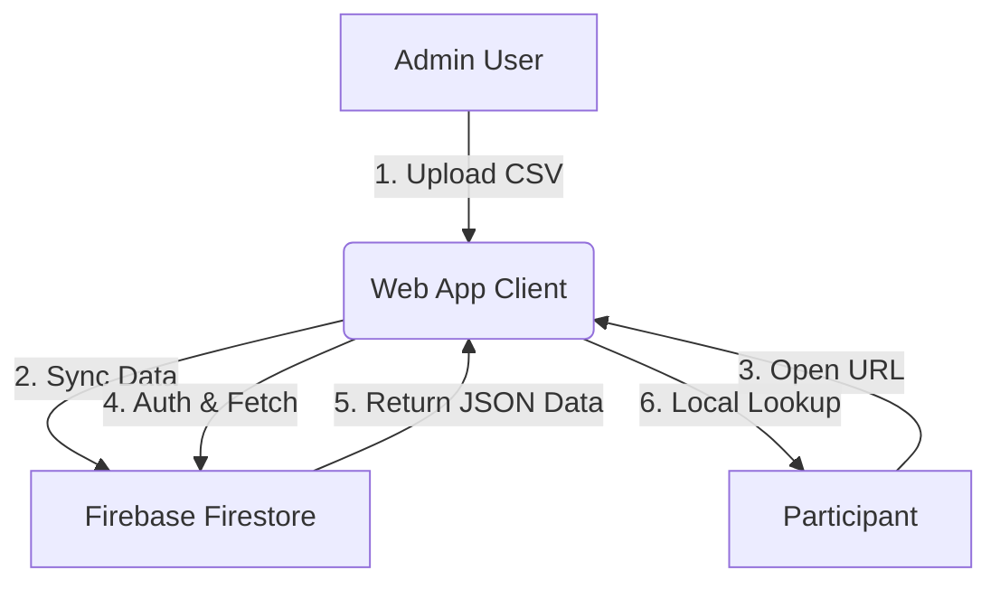

# Project Status & Technical Mechanism: Bus Lookup System

## 1. Project Progress Status

We have successfully built and verified the core application. The system is a **Single Page Application (SPA)** that runs entirely in the browser, powered by **Firebase** for backend data syncing.

### ✅ Completed Features

* **Participant Lookups**: Users can enter their Name and Phone Number to retrieve their assigned Bus and Departure Time.
* **Admin Interface**: A hidden "Admin Mode" allows the client to upload the latest participant data via a CSV file.
* **Cloud Sync**: Data is instantly authenticated and synced to a global Firestore database.
* **Security**: basic anonymous authentication prevent abuse.
* **Responsive Design**: Mobile-optimized with premium animations.

### 🚀 Deployment: GitHub Pages

The project is hosted on **GitHub Pages**.

* **Repository**: [choiys080/Bus_Lookup](https://github.com/choiys080/Bus_Lookup)
* **Live Site**: [https://choiys080.github.io/Bus_Lookup/](https://choiys080.github.io/Bus_Lookup/)

### 📂 File Versions

* **`index.html`**: The live version (Currently deployed from `2602041619.html`)
* **`index_old.html`**: Backup of the original version.

---

## 2. Technical Mechanism

The system operates on a **Serverless / Static** architecture.

### The Flow

1. **Admin Upload**: Admin toggles "Admin Mode", uploads CSV. Data synced to Firestore `artifacts/{appId}/public/data/participants`.
2. **User Access**: Participants enable the site -> Code loads from GitHub -> Data loads from Firestore.
3. **Local Lookup**: Code runs locally to find the match.

### Architecture Diagram

