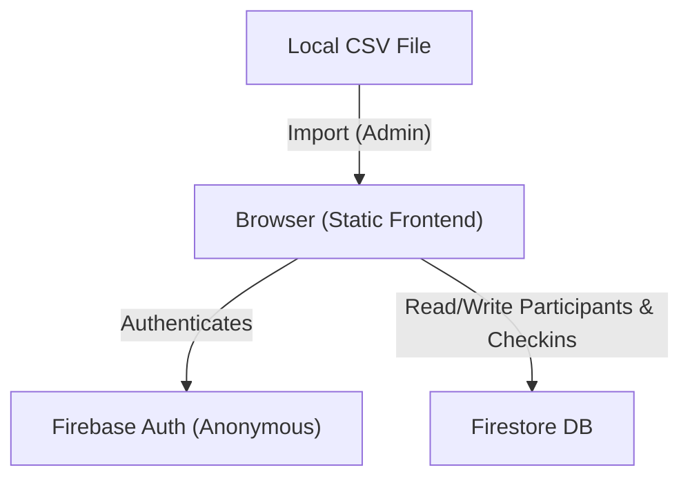
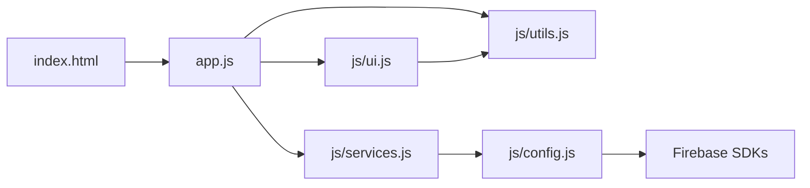
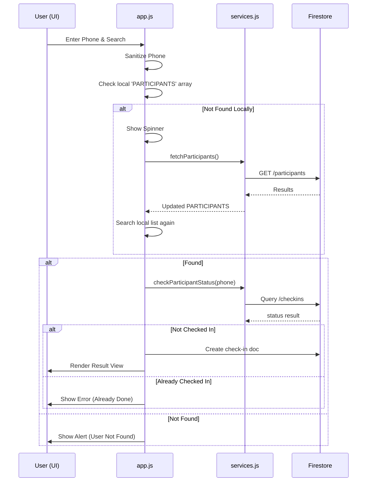

# Application Architecture Map: Bus_Lookup (modv2)

This document provides a high-level overview of the system architecture, component relationships, and core logic flows for the `modv2` application. It is designed for efficient parsing by both AI agents and human developers.

## 1. System Architecture Overview

The application is a client-side web app that interacts directly with **Firebase (Auth & Firestore)**.

## 2. Component Relationship Map

The codebase is organized into a modular structure where `app.js` acts as the orchestrator.

| Component | Responsibility | Key Functions |
| :--- | :--- | :--- |
| **`app.js`** | Main orchestrator, Event listeners, State management. | `handleLookup`, `initAuth`, `csvUpload.onchange` |
| **`ui.js`** | DOM manipulation, View switching, Result rendering. | `showView`, `renderResult`, `updateAdminDashboard` |
| **`services.js`** | Firebase CRUD operations using Firestore SDK. | `fetchParticipants`, `listenToCheckins`, `batchUploadParticipants` |
| **`utils.js`** | Data sanitization, parsing, and non-blocking helpers. | `sanitizePhoneNumber`, `parseCSVLine`, `getSafeHeader` |
| **`config.js`** | Firebase project keys and `appId` definition. | `appId`, `db`, `auth` |

## 3. Core Logic Flow: Participant Lookup

The "Hail Mary" lookup strategy ensures data consistency even when local state is slightly behind.

## 4. Firestore Data Structure

All data is stored under the `artifacts` collection to prevent root-level clutter.

| Path | Description | Key Fields |
| :--- | :--- | :--- |
| `artifacts/[appId]/public/data/participants/[id]` | List of authorized participants. | `name`, `phone`, `activity_name`, `department`, `schedule_1...3`, `supplies`, `notice`, `meeting_point`, `start_time` |
| `artifacts/[appId]/public/data/checkins/[phone]` | Real-time check-in records. | `name`, `phone`, `activity`, `department`, `checkedInAt` |

## 5. Security & Configuration

- **Authentication**: Anonymous sign-in for public users; simple password (`admin123`) for local dashboard access.
- **App Specificity**: Hardcoded `appId` in `config.js` ensures each event instance is isolated.
- **Loose Matching**: `getSafeHeader` utility ensures CSV imports are resilient to manual human entry errors.
